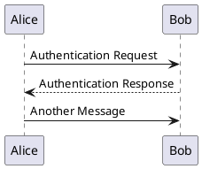

<!---
{
  "id": "c8353038-9b0b-4ff5-b872-7df816d31fc3",
  "teaches": "Rendering Sequence Diagrams with Kroki and PlantUML",
  "depends_on": ["e8add8e9-7a67-4b50-af89-6c1ce6558e0d"],
  "author": "Stephan Bökelmann",
  "first_used": "2025-05-06",
  "keywords": ["PlantUML", "Kroki", "Sequence Diagram", "Docker", "SVG Rendering"]
}
--->

# Rendering Sequence Diagrams with Kroki and PlantUML

> In this exercise you will learn how to create a basic sequence diagram using PlantUML syntax in a text file. Furthermore we will explore how to render this diagram to SVG format using the Kroki API, and subsequently by running Kroki locally on Ubuntu via a Docker container.

### Introduction

Visualizing system interactions is critical for understanding and communicating software behavior. Sequence diagrams offer a structured method to represent the order and interaction of messages between system components over time. One of the most popular tools to define such diagrams is [PlantUML](https://plantuml.com), which allows developers to write UML diagrams in plain text.

To render PlantUML diagrams to formats like SVG, we can use [Kroki](https://kroki.io), an open-source diagram rendering service that supports many diagram types. Kroki provides both a public web API and a Docker-based deployment for local usage.

In this exercise, you will write a simple PlantUML sequence diagram in a text file and render it to SVG in two ways: using Kroki's public API and by running Kroki locally on Ubuntu via a Docker container. You will also learn how to use HTTP request tools (like `curl`) and understand how Docker facilitates portable and isolated environments.

This process helps build familiarity with modern DevOps tools and practices, and reinforces the idea of infrastructure as code.

### Further Readings and Other Sources

* [Kroki Documentation](https://docs.kroki.io/)
* [PlantUML Sequence Diagrams](https://plantuml.com/sequence-diagram)
* [Kroki GitHub Repository](https://github.com/yuzutech/kroki)
* [Docker Getting Started](https://docs.docker.com/get-started/)

### Tasks

#### 1. Write a Simple Sequence Diagram

Create a file named `sequence.puml` with the following content:



#### 2. Render to SVG using the Kroki API

Use `curl` to send the diagram content to Kroki's public API:

```bash
curl -H "Content-Type: text/plain" \
     --data-binary @sequence.puml \
     https://kroki.io/plantuml/svg -o sequence.svg
```

This command uploads the plain text file and retrieves the resulting SVG image.

#### 3. Run Kroki via Docker

Pull and run the Kroki container:

```bash
docker pull yuzutech/kroki

docker run -d -p 8000:8000 yuzutech/kroki
```

Then use `curl` to post your file to the local server:

```bash
curl -H "Content-Type: text/plain" \
     --data-binary @sequence.puml \
     http://localhost:8000/plantuml/svg -o sequence_local.svg
```

You can now compare both SVG outputs.

### Questions

1. What is the purpose of the `@startuml` and `@enduml` tags in a `.puml` file?
2. What HTTP method is used by `curl` in this exercise, and why is it appropriate?
3. How does running Kroki in Docker improve portability and reproducibility?
4. Compare the output of the public Kroki API and the local Docker instance. Are there any differences?
5. Why might someone prefer to use a local Kroki instance instead of the public API?

### Advice

Understanding how to transform text-based diagram specifications into visual formats is a valuable skill in documentation, software design, and DevOps workflows. Start with the simplest approach — using the Kroki API — to grasp how the process works. Once that’s clear, transitioning to a Dockerized version is a natural next step for offline or private use cases. Don’t be discouraged by setup or command-line complexity; it’s all part of learning reproducible infrastructure techniques. If you're unfamiliar with Docker, check out the Docker exercise sheet [here](./docker_basics.md) for more foundational guidance.
